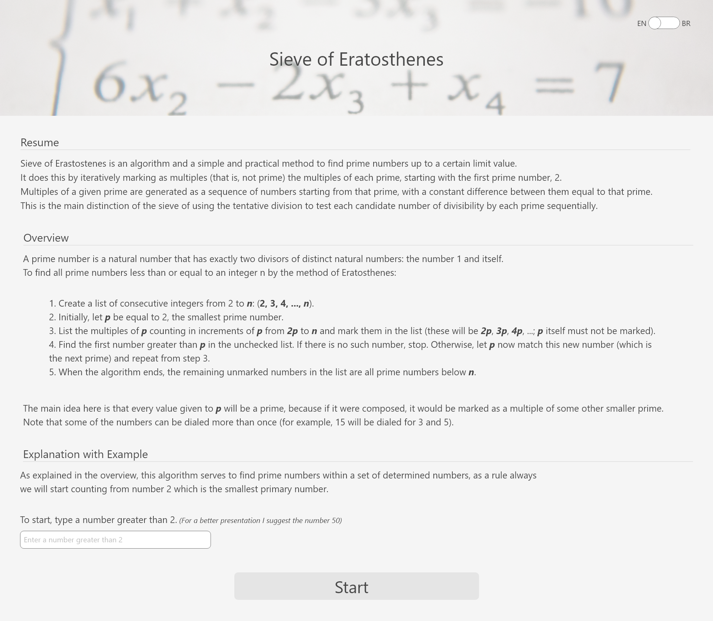
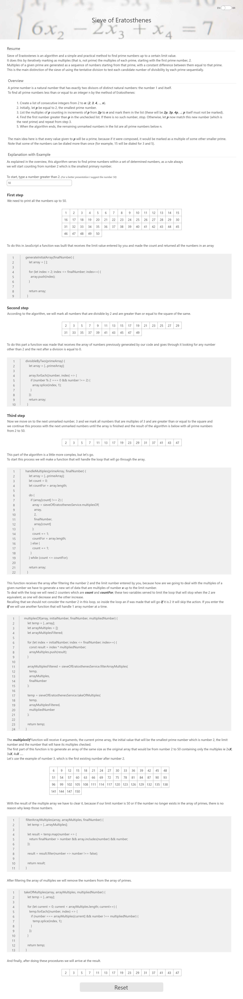

# Sieve of Eratosthenes

## Resume

In a group of **Discord** aimed at people who want or are already in the _T.I_ market, a question arose about how to find prime numbers within a set of numbers, after some explanations I went after a way to trying to help solve the doubts I chose **Sieve of Eratosthenes** as a way to explain.
**Sieve of Eratosthenes** is an algorithm aimed at finding prime numbers within a given set of numbers, as the name says it sifts the numbers and that consists of always starting from the smaller prime which is number 2 and going up and out some numbers according to certain rules. With that I created a page that explains the algorithm with _JavaScript_, and the person himself can choose with which number he will test the application.

## UX

Before starting to program I wanted to create _UX_ to decide how to explain and how the interactions with the page would be.
The first idea was to create a bilingual application because I have seen several sites that have this option, but I had never built such an application before.

### Header default

### Header traduzido

After that I structured a more theoretical explanation that I found on the website [GeeksforGeeks](https://www.geeksforgeeks.org/sieve-of-eratosthenes/) and on [Wikipedia](https://en.wikipedia.org/wiki/Sieve_of_Eratosthenes). I also built a way for the user to enter a limit number for the calculation to be demonstrated.

### Initial page

After the user enters a number greater than 2 and clicks the button, the page will explain in 3 steps how this calculation works, both the theoretical part of the steps and with _JavaScript_.

### Final page

## Code

If you want to see the code just access the [Demo](https://codesandbox.io/embed/sieveoferatosthenes-uriuc?fontsize=14&hidenavigation=1&theme=dark)

## Commands enabled

`npm start` : Run the application
